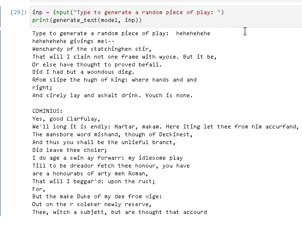

# RNN-Play-Generator
This Project was built to study & understand Recurrent Neural Networks(RNN) which are considered the best for Natural Language Processing(NLP).
This project makes use of the Shakespeare play dataset from google. I have also included a code block to upload your own text file to custom train the model (to use it, uncomment it).
The output is got after the user is prompted to type some text as input (which can be just a word or also be a sentence). Post input, the model will run and in a few sconds produce an extract from the dataset (shakespeare or custom according to user) of a play, poem or movie script.
# Sample Output 1

# Sample Output 2

